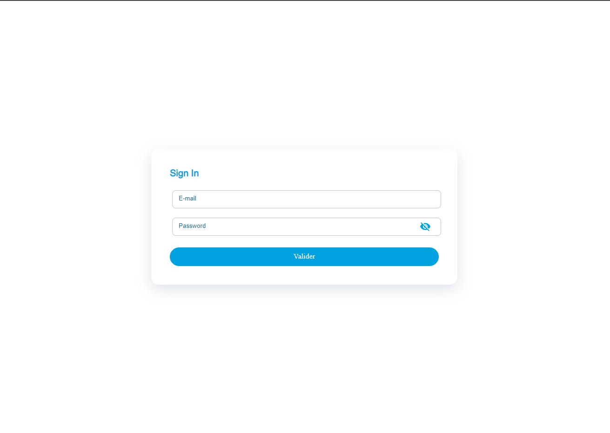

# Authentification template

> ### An authentification application built with ReactJS v17, Redux, Redux Toolkit, Redux Saga, React final form, i18next, TypeScript, Mui, eslint, prettier and SCSS.

To run this project I will be assuming that you have all the tools to run ReactJs v17 (NodeJS >= 6).

---

## Contents

- [Project Screen Shots](#project-Screen-Shots)
- [Getting started](#getting-started)
- [Available Scripts](#available-scripts)
- [Project structure](#project-structure)
- [Technologies used](#technologies-used)
  - [ReactJs](#reactjs)
  - [Redux](#redux)
  - [Redux Toolkit](#redux-toolkit)
  - [Redux Saga](#redux-saga)
  - [React final form](#React-final-form)
  - [Material ui](#material-ui)
  - [i18next](#i18next)
  - [TypeScript](#typescript)

---

## Project Screen Shots

#### Login page:

# 

#### Home page:

# 

---

## Getting started

Switch to the repo folder

    cd Auth

Install all the dependencies and the packages

    yarn install

Copy the example env file and make the required configuration changes in the .env file

    cp .env.example .env

Start the local development server

    yarn start

You can now access the server at http://localhost:3000

---

## Available Scripts

| Script       | Description                                            |
| ------------ | ------------------------------------------------------ |
| `install`    | Installs all the needed packages and dependecies.      |
| `start`      | Runs the app in the development mode.                  |
| `build`      | Builds the app for production to the `build` folder.   |
| `prettier`   | Format your code with Prettier                         |
| `typecheck`  | Typecheck your app.                                    |
| `test`       | Launches the test runner in the interactive watch mode |
| `lint`       | Lint both your code and style with ESLint.             |
| `lint:fix`   | Fix ESLint errors.                                     |
| `lint:style` | Lint your css with ESLint.                             |
| `eject`      | Remove the single build dependency from your project.  |

---

## Project structure

```
|-- .husky (1)
|-- build (2)
|-- node_modules (3)
|-- public (4)
    |-- favicon.png
    |-- index.html
    |-- manifest
|-- src (5)
    |-- assets (6)
        |-- fonts
        |-- sass
    |-- core (7)
        |-- constant
        |-- enums (8)
        |-- generated (9)
        |-- models (10)
        |-- services (11)
        |-- utils (12)
    |-- locales (13)
    |-- modules (14)
    |-- pages (15)
    |-- routes (16)
    |-- shared (17)
        |-- components
        |-- guard
        |-- interfaces
        |-- theme
        |-- validators
    |-- store (18)
    |-- App.tsx (19)
    |-- i18n.ts
    |-- index.tsx (20)
    |-- server-worker.ts
|-- .env (21)
|-- .eslintrc
|-- .prettierrc
|-- .stylelintrc
|-- package.json (22)
|-- README.md
|-- yarn.lock
```

(1) : an auto generated folder by husky.

(2) : Is the location of your final, production-ready build. this directory won’t exist until you run npm build or yarn build.

(3) : Is where packages installed by NPM or Yarn will reside.

(4) : Is where your static files reside. (They automatically get copied to build while using create-react-app)

(5) : Is where your dynamic files reside (written codes).

(6) : Contains static files (img,sass).

(7) : The core folder of the application.

(8) : Where we define the a sets of named constants that is used in the app.

(9) : Is where we define the interfaces for the returned data from the backend.

(10) : the models used everywhere in the app.

(11) : The list of services, helpers used.

(12) : Where the mapping and redux saga reusable function can be found.

(13) : Contains the internationalization used in the application (contains all messages displayed in interfaces)

(14) : Each unit in the app is a module and each module has its components, state, styling ... to make it easier to maintain.

(15) : Contains all the interfaces of the application. Each interface is composed of one or more components.

(16) : Contains all the different types of routes.

(17) : The list of shared components, interfaces and themes.

(18) : The global store of the app, where we find the list of actions, effects, reducers and types combined.

(19) : This is the file for App Component. App Component is the main component in React which acts as a container for all other components.

(20) : The entry point of the application. this file has the following line of code which is very significant.

(21) : Contains all the environment variables.

(22) : This File has the list of node dependencies which are needed.

---

## Technologies used

### ReactJs

React is a JavaScript library for building user interfaces, it is used to build single-page applications and allows us to create reusable UI components.

### Redux

Redux is a state container for JavaScript apps. It is most commonly paired with React, where it takes control of state away from React components and gives it to a centralised place called a ‘store’.

### Redux Toolkit

Redux Toolkit is a dogmatic, sequences-included toolset for well-organized redux development. Redux has developed a valued asset for handling a global React state.

### Redux Saga

Redux saga reacts as a middleware that takes over the control of you actions before reaching the reducer directly.

### React final form

Final Form is a Subscription-based, high performant form state management Framework can be used with VanillaJS Forms and React forms.

### Material ui

React components for faster and easier web development, used for the design.

### i18next

react-i18next is a powerful internationalization framework for React / React Native which is based on i18next. (Learn once — translate everywhere)

### TypeScript

TypeScript is a superset of JavaScript, meaning that it contains all of the functionality of JavaScript and then some. Therefore, any program written in valid JavaScript will also run as expected in TypeScript. In fact, TypeScript compiles simply to plain JavaScript.
TypeScript offers us more control over our code via type annotations, interfaces, and classes.
